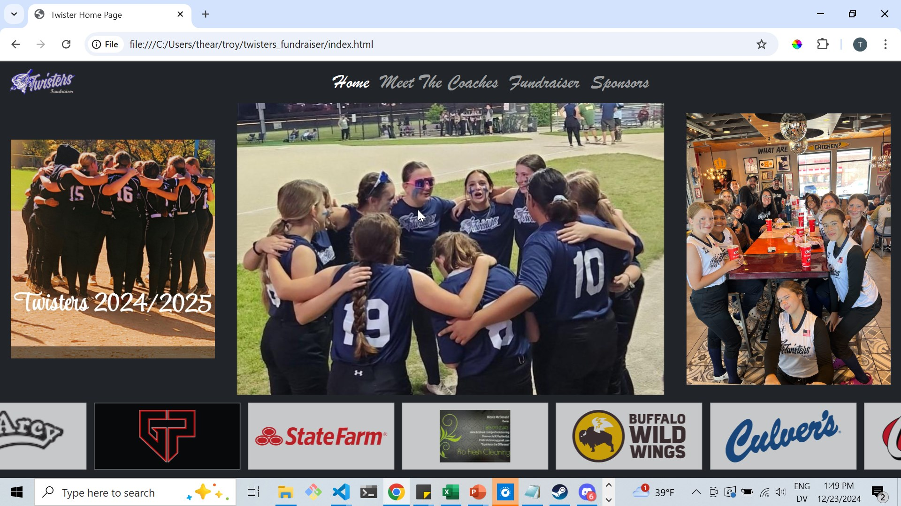
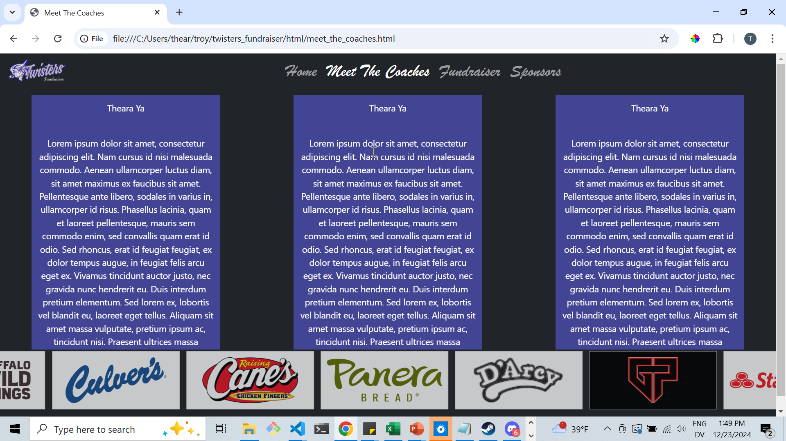
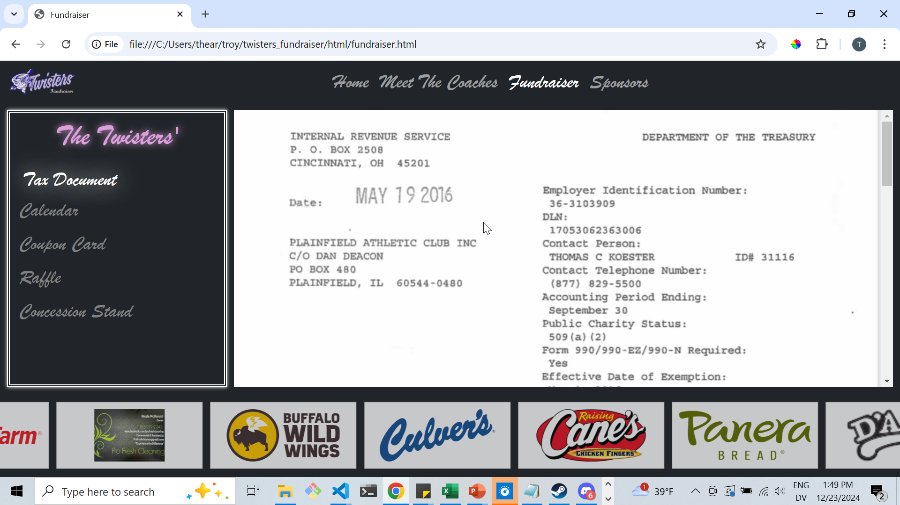

# The Plainfield Twisters' Fundraising Website #

#### Safe Git Commands: ####
1. git clone `github-url`\
Downloads the repository from GitHub and creates a ***local*** copy on your computer.

2. git pull\
Update your ***local*** copy with new changes that may have been added online to GitHub

3. git checkout `branch-name`
Switches between different versions of the code. Run `git checkout dev` to see the latest development changes.

#### Screenshots: ####

### Home ###

### Meet The Coaches ###

### Fundraiser ###

### Sponsors ###
